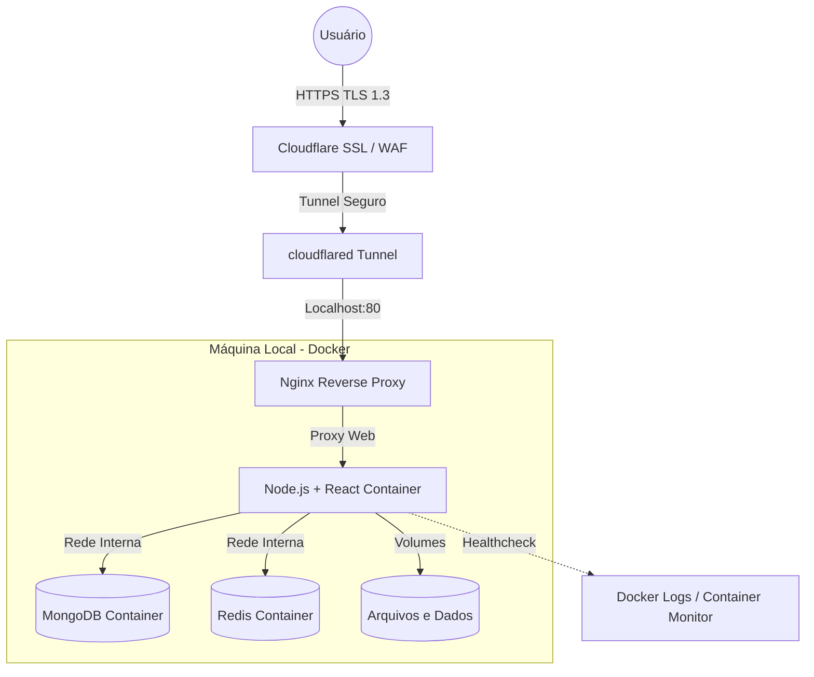

<div align="center">

# 🏭 AXION — Industrial Operations Platform
### *Industrial Self-Hosted Infrastructure • Lean Enterprise Tier*

**A vanguarda da orquestração industrial enxuta para fábricas inteligentes.**

[]()
[]()
[]()

</div>

---

## 📋 Sumário Executivo

O **AXION** é uma plataforma de monitoramento e orquestração de ocorrências industriais focada no controle de frotas de AGVs (*Automated Guided Vehicles*), paradas de linha e manutenção preditiva. 

Projetada com a filosofia **Lean Enterprise**, a infraestrutura atual é perfeitamente dimensionada para atender plantas industriais e montadoras de médio porte (~150 a 200 operadores cadastrados), assegurando alta resiliência, tempo real e governança estrita de dados sem incorrer nos custos exorbitantes de topologias sobredimensionadas (*Overengineering*).

---

## 🏗️ Arquitetura (Self-Hosted + Cloudflare Tunnel)

A infraestrutura consagra o princípio de que **arquitetura limpa > arquitetura gigante**, garantindo máxima segurança de borda, isolamento de contêiner e **custo zero de hospedagem**:



### Vantagens do Self-Hosting com Cloudflare Tunnel:
- **R$ 0 de hospedagem** — usa seu próprio computador
- **Sem abrir portas no roteador** — o tunnel faz uma conexão de saída segura
- **HTTPS automático** — Cloudflare gerencia SSL gratuitamente
- **DDoS Protection** — WAF da Cloudflare protege sua rede doméstica
- **IP residencial protegido** — seu IP real nunca é exposto

---

## 🚀 Guia Completo de Self-Hosting (Passo a Passo)

Este é o guia definitivo para hospedar o AXION no seu próprio computador com domínio personalizado.

### Pré-requisitos

| Requisito | Detalhes |
|:---|:---|
| **Sistema Operacional** | Windows 10/11 com Docker Desktop |
| **Hardware Mínimo** | 4 núcleos de CPU, 8 GB de RAM |
| **Internet** | Conexão estável (fibra recomendada) |
| **Domínio** | Domínio próprio já comprado (ex: `axion.com.br`) |
| **Conta Cloudflare** | Conta gratuita em [cloudflare.com](https://cloudflare.com) |
| **Docker Desktop** | Instalado e rodando — [download](https://www.docker.com/products/docker-desktop/) |

---

### Fase 1: Preparar o Domínio no Cloudflare

> [!IMPORTANT]
> Se o seu domínio já está no Cloudflare, pule para a Fase 2.

1. Crie uma conta gratuita no [Cloudflare](https://dash.cloudflare.com/sign-up).
2. Clique em **"Add a site"** e digite seu domínio (ex: `axion.com.br`).
3. Selecione o plano **Free** e clique em **Continue**.
4. O Cloudflare mostrará 2 **nameservers** (ex: `ada.ns.cloudflare.com`).
5. Vá no painel do seu registrador de domínio (Registro.br, GoDaddy, etc.) e **altere os nameservers** para os fornecidos pelo Cloudflare.
6. Aguarde a propagação DNS (pode levar de 5 minutos a 24 horas).
7. Quando o Cloudflare mostrar **"Active"**, seu domínio está configurado.

---

### Fase 2: Criar o Cloudflare Tunnel

O Cloudflare Tunnel é a peça-chave que permite expor seu computador local para a internet de forma segura, **sem abrir portas no roteador** e **sem expor seu IP residencial**.

#### 2.1 — Instalar o `cloudflared` no Windows

1. Baixe o instalador oficial:
   - [cloudflared para Windows (64-bit)](https://github.com/cloudflare/cloudflared/releases/latest/download/cloudflared-windows-amd64.msi)
2. Execute o `.msi` e instale com as configurações padrão.
3. Abra o **PowerShell como Administrador** e verifique a instalação:
   ```powershell
   cloudflared --version
   ```

#### 2.2 — Autenticar com o Cloudflare

```powershell
cloudflared tunnel login
```
- Uma janela do navegador será aberta automaticamente.
- Selecione o seu domínio e clique em **"Authorize"**.
- O certificado será salvo em `%USERPROFILE%\.cloudflared\cert.pem`.

#### 2.3 — Criar o Tunnel

```powershell
cloudflared tunnel create axion
```

> [!TIP]
> Anote o **Tunnel ID** exibido (ex: `a1b2c3d4-e5f6-7890-abcd-ef1234567890`). Você vai precisar dele.

#### 2.4 — Configurar o Roteamento DNS

```powershell
cloudflared tunnel route dns axion app.seudominio.com.br
```
> Substitua `app.seudominio.com.br` pelo subdomínio desejado. Isso cria automaticamente um registro CNAME no Cloudflare.

#### 2.5 — Criar o Arquivo de Configuração

Crie o arquivo `%USERPROFILE%\.cloudflared\config.yml` com o seguinte conteúdo:

```yaml
tunnel: <SEU-TUNNEL-ID>
credentials-file: C:\Users\<SEU-USUARIO>\.cloudflared\<SEU-TUNNEL-ID>.json

ingress:
  - hostname: app.seudominio.com.br
    service: http://localhost:80
  - service: http_status:404
```

> [!WARNING]
> Substitua `<SEU-TUNNEL-ID>` pelo ID do tunnel criado no passo 2.3, e `<SEU-USUARIO>` pelo nome de usuário do Windows.

#### 2.6 — Testar o Tunnel

```powershell
cloudflared tunnel run axion
```

Se tudo estiver correto, você verá logs indicando que o tunnel está conectado. Mantenha o terminal aberto por enquanto.

---

### Fase 3: Configurar e Subir o AXION

#### 3.1 — Clonar o Repositório (se ainda não fez)

```powershell
git clone <URL-DO-SEU-REPOSITORIO> axion
cd axion
```

#### 3.2 — Configurar as Variáveis de Ambiente

```powershell
# Crie o arquivo .env a partir do modelo
copy .env.example .env
```

Edite o arquivo `.env` e preencha as variáveis obrigatórias:

```env
# ═══════════════════════════════════════════════════════
# AXION — Variáveis de Ambiente de Produção
# ═══════════════════════════════════════════════════════

# Segurança (OBRIGATÓRIO - Gere valores aleatórios seguros)
JWT_SECRET=sua-chave-jwt-secreta-aqui-minimo-32-caracteres
ENCRYPTION_KEY=sua-chave-de-criptografia-aqui-32-chars

# Admin Inicial (Criado no primeiro boot)
SEED_ADMIN_USERNAME=AxionAdmin
SEED_ADMIN_PASSWORD=#SuaSenhaSegura123

# Domínio de Produção (OBRIGATÓRIO para self-hosting com domínio)
# Adicione aqui a URL exata do seu domínio para evitar erro 403 no login
CORS_ORIGINS=https://app.seudominio.com.br

# SMTP para notificações por e-mail (Opcional)
SMTP_HOST=smtp.gmail.com
SMTP_PORT=587
SMTP_SECURE=false
SMTP_USER=
SMTP_PASS=

# WhatsApp API (Opcional)
WHATSAPP_API_URL=
WHATSAPP_API_KEY=
WHATSAPP_SENDER_NUMBER=
```

#### 3.3 — Gerar Certificado SSL (Para o Nginx interno)

O certificado SSL interno é necessário para o bloco HTTPS do Nginx. Em produção com Cloudflare, o SSL é terminado na borda, mas o certificado local ainda é requerido para a porta 443:

```powershell
mkdir -p nginx\ssl
openssl req -x509 -nodes -days 3650 -newkey rsa:2048 `
  -keyout nginx\ssl\key.pem `
  -out nginx\ssl\cert.pem `
  -subj "/CN=axion-local"
```

> [!NOTE]
> Se preferir máxima segurança, use um **Origin Certificate** do Cloudflare (veja a seção "Modo Avançado" abaixo).

#### 3.4 — Subir a Stack Docker

```powershell
docker compose up -d --build
```

Aguarde até que todos os serviços estejam saudáveis:

```powershell
docker ps
```

Resultado esperado:
```
NAMES              STATUS                     PORTS
axion_nginx        Up X seconds               0.0.0.0:80->80/tcp, 0.0.0.0:443->443/tcp
Axion-Technology   Up X seconds (healthy)     3000/tcp
axion_redis        Up X seconds               6379/tcp
axion_mongo        Up X seconds (healthy)     27017/tcp
```

#### 3.5 — Verificar Acesso Local

Acesse `http://localhost` no navegador. Você deve ver a tela de login do AXION.

---

### Fase 4: Instalar o Tunnel como Serviço do Windows

Para que o tunnel inicie automaticamente quando o computador ligar (sem precisar abrir terminal):

```powershell
# Executar como Administrador
cloudflared service install
```

Isso cria um **Serviço do Windows** chamado `Cloudflared` que roda em background. Você pode gerenciá-lo em `services.msc`.

Para verificar o status:
```powershell
sc query cloudflared
```

> [!IMPORTANT]
> Certifique-se de que o **Docker Desktop** também está configurado para iniciar automaticamente com o Windows:
> Docker Desktop → Settings → General → ✅ **Start Docker Desktop when you sign in**

---

### Fase 5: Configurar SSL no Cloudflare

1. No painel do [Cloudflare](https://dash.cloudflare.com/), acesse seu domínio.
2. Vá em **"SSL/TLS"** → **"Overview"**.
3. Selecione o modo **"Full"** (ou **"Full (Strict)"** se usar Origin Certificate).
4. Vá em **"Edge Certificates"** e ative:
   - ✅ **Always Use HTTPS**
   - ✅ **Automatic HTTPS Rewrites**
   - ✅ **Minimum TLS Version: 1.2**

---

### Fase 6: Testar Acesso Externo

Acesse de qualquer dispositivo (celular, outro computador):

```
https://app.seudominio.com.br
```

🎉 **Sua plataforma AXION está no ar, acessível globalmente, protegida pelo Cloudflare e rodando no seu próprio computador!**

**Credenciais de acesso padrão:**
- **Matrícula:** `1111111` (ou conforme configurado no `SEED_ADMIN_USERNAME`)
- **Senha:** Conforme configurado no `SEED_ADMIN_PASSWORD`

---

## 🛡️ Modo Avançado: Origin Certificate (SSL Full Strict)

Para máxima segurança entre Cloudflare e seu servidor:

1. No Cloudflare → **SSL/TLS** → **Origin Server** → **Create Certificate**.
2. Mantenha as configurações padrão (RSA, 15 anos) e clique em **Create**.
3. Copie o **Origin Certificate** e salve em `nginx/ssl/cert.pem`.
4. Copie a **Private Key** e salve em `nginx/ssl/key.pem`.
5. No Cloudflare, mude o modo SSL para **"Full (Strict)"**.

---

## 🔄 Backup Automático do MongoDB

Configure um backup automático diário usando o Task Scheduler do Windows:

### Opção A — Script PowerShell:

Crie o arquivo `scripts/backup-mongo.ps1`:

```powershell
$date = Get-Date -Format "yyyy-MM-dd"
docker exec axion_mongo mongodump --archive="/data/db/backup_$date.gz" --gzip
Write-Host "Backup realizado: backup_$date.gz"
```

### Opção B — Agendamento no Task Scheduler:

1. Abra o **Agendador de Tarefas** do Windows (`taskschd.msc`).
2. Clique em **"Criar Tarefa Básica"**.
3. Nome: `AXION MongoDB Backup`.
4. Gatilho: **Diariamente** às **03:00**.
5. Ação: **Iniciar um programa**.
   - Programa: `powershell.exe`
   - Argumentos: `-ExecutionPolicy Bypass -File "C:\caminho\para\scripts\backup-mongo.ps1"`
6. Marque **"Executar estando o usuário conectado ou não"**.
7. Clique em **Concluir**.

---

## 💰 Previsibilidade de Custos (Self-Hosted)

A topologia **Self-Hosted** elimina completamente os custos recorrentes de infraestrutura:

| Serviço / Componente | Custo Estimado | Objetivo Operacional |
|:--- |:--- |:--- |
| **Computador (Host Principal)** | **R$ 0 / mês** | Usa sua máquina existente. |
| **MongoDB / Redis Internos** | **R$ 0 / mês** | Contêineres rodam integrados na máquina local. |
| **Cloudflare WAF / SSL / Tunnel** | **R$ 0 / mês (Free)** | Terminação HTTPS, proteção DDoS, WAF e Tunnel gratuitos. |
| **Domínio** | **~ R$ 40 / ano** | Custo anual do registro do domínio. |
| **Custo Operacional Total** | **~ R$ 3 / mês** | **Apenas o custo rateado do domínio. Infraestrutura 100% gratuita.** |

---

## 📈 Trilha de Evolução de Escala (Quando Escalar)

A arquitetura foi projetada para crescer de forma orgânica e modular. Os gatilhos abaixo determinam o momento exato para a transição de componentes:

| Vetor de Crescimento | Evolução Arquitetural Recomendada |
|:--- |:--- |
| **Automação de Entregas (Build Seguro)** | Migração para **CI/CD no GitHub Actions** (Build na nuvem e deploy de imagem pronta). |
| **Governança de Logs e Métricas** | Implantação de **Observabilidade Real** (Prometheus, Grafana, Loki e Uptime Kuma). |
| **Aumento no tráfego de Websockets** | Ativação da camada de barramento com Redis Pub/Sub. |
| **Múltiplas plantas industriais ativas** | Migração para VPS dedicada (DigitalOcean, Hetzner) ou AWS ECS. |
| **Segurança Absoluta de Segredos** | Transição do `.env` local para **Vault** ou Doppler. |
| **Alta Disponibilidade (99.9% SLA)** | Migração para cloud com redundância multi-zona. |

---

## 💼 Modelo Comercial B2B (Industrial SLA)

O licenciamento da plataforma assegura o acompanhamento técnico e a evolução contínua da planta:

| Componente | Valor (BRL) | Escopo de Entrega |
|:--- |:--- |:--- |
| **Setup Fee** | R$ 40.000,00 | Mapeamento detalhado da planta, implantação de infraestrutura Lean e capacitação de operadores. |
| **Recorrência Mensal** | R$ 30.000,00 | Engenharia de plataforma, suporte especializado de missão crítica e evolução operacional. |

---

## 🚀 Guia de Desenvolvimento e Simulação (`DEV` Environment)

O ambiente de desenvolvimento local permanece inteiramente conteinerizado, garantindo que novas funcionalidades sejam exaustivamente testadas de forma idêntica ao ecossistema de produção.

```bash
# 1. Instalar dependências da plataforma
npm install

# 2. Provisionar o arquivo de ambiente local isolado
copy .env.example .env

# 3. Subir a stack de desenvolvimento local isolada
docker compose up -d --build
```

> [!IMPORTANT]
> **Governança de Identidade Inicial:** Alinhado às mais estritas práticas de segurança corporativa, o repositório não expõe credenciais de acesso em texto plano. A conta de administração raiz (*SuperAdmin*) é provisionada de forma totalmente segura e dinâmica durante a inicialização primária do sistema através de variáveis de ambiente restritas ou por meio de rotinas formais e auditadas de Onboarding.

---

## 🔧 Troubleshooting

| Problema | Causa | Solução |
|:---|:---|:---|
| `ERR_CONNECTION_REFUSED` | Docker não está rodando | Inicie o Docker Desktop e execute `docker compose up -d` |
| Container `unhealthy` | Cluster Node.js ainda inicializando | Aguarde 60s (start_period). Verifique com `docker logs Axion-Technology` |
| `502 Bad Gateway` | App não respondeu a tempo | Verifique `docker ps`. Se o app está `starting`, aguarde. |
| Tunnel não conecta | Configuração errada do `config.yml` | Verifique o Tunnel ID e o `credentials-file` path |
| SSL error no navegador | Certificado autoassinado (acesso local) | Use `http://localhost` localmente. O HTTPS funciona via Cloudflare. |

---

<div align="center">
<sub><strong>AXION Technology</strong> — Industrial Operations Intelligence • Self-Hosted Infrastructure</sub><br/>
<sup>v2.0.0-selfhosted-stable</sup>
</div>
